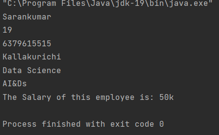

## Java-Ex-10
### Create a class named 'Member' having the following members:

### Data members

### 1 - Name

### 2 - Age

### 3 - Phone number

### 4 - Address

### 5 - Salary

### It also has a method named 'printSalary' which prints the salary of the members. Two classes 'Employee' and 'Manager' inherits the 'Member' class. The 'Employee' and 'Manager' classes have data members 'specialization' and 'department' respectively. Now, assign name, age, phone number, address and salary to an employee and a manager by making an object of both of these classes and print the same.
## Aim:
To write a Java program using inheritance and Properties one class can acquire the properties of others.

## Algorithm
### Step 1 : 
Open Intelli J application or any other code editor.

### Step 2 : 
Create a class called "Employee" and create required statements.

### Step 3 : 
Create a another class called "Manager" and create required statements.

### Step 3 : 
Create another class,called the "Member" and create required statements

### Step 4 : 
Create a main class,called the "Solution".

### Step 5 : 
Using the 'extends' keyword you can inherit classes, do the same with above created class.

### Step 6 : 
Display the statements from the first and second Class using Solution Class in the terminal.

## Program
```java
public class Employee extends Member {
    public String specialization;
}
public class Manager extends Member {
    public String departemnt;
}
public class Member {
    public String name;
    public int age;
    public String ph;
    public String address;
    public String sal;
    public void dissal() {
        System.out.println("The Salary of this employee is: " + sal);
    }
}
public class Solution {
    public static void main(String[] args) {
        Employee emp1 = new Employee();
        Manager emp2 = new Manager();
        emp1.name = "Sarankumar";
        emp1.age = 19;
        emp1.ph = "6379615515";
        emp1.address = "Kallakurichi";
        emp1.sal = "50k";
        emp2.departemnt = "AI&Ds";
        emp1.specialization = "Data Science";
        System.out.println(emp1.name + "\n" + emp1.age + "\n" + emp1.ph + "\n" + emp1.address + "\n" + emp1.specialization + "\n" + emp2.departemnt);
        emp1.dissal();

    }
}
```
## Output


## Result
We have successfully created a Java program using inheritance one class can acquire the properties of others.